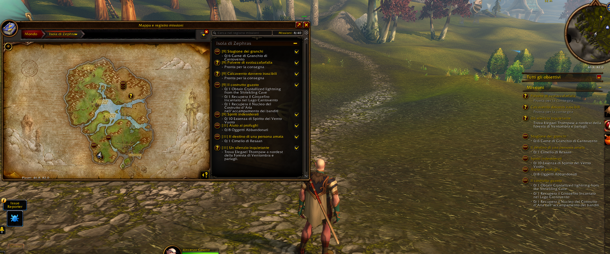
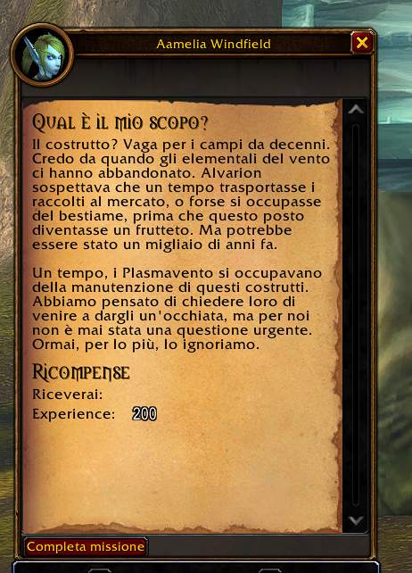
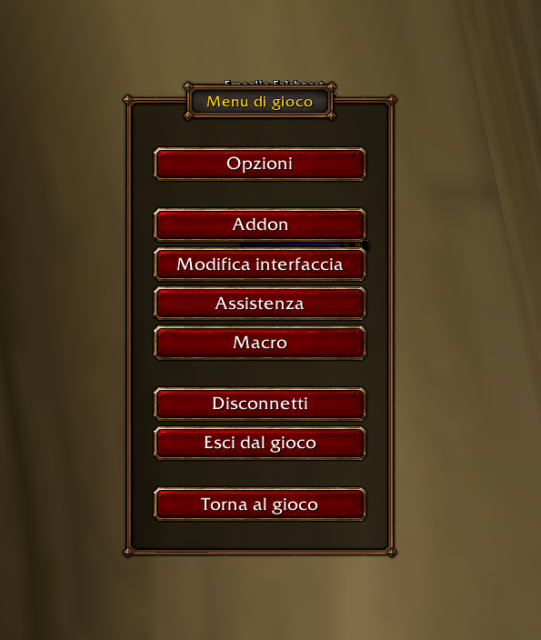

# WoWForeverIT

Italian quest and interface localization for the **WoW Forever beta**. Community project by [polletto](https://github.com/polletto), with quest data and text utilities adapted from **QuestIT 0.8.6 by Drakanast**.

**Version 0.9.4 · Beta · Interface 16001**

## Italiano

WoWForeverIT traduce direttamente le finestre delle missioni, il registro nella mappa e il tracker. Include anche un primo dizionario per il menu Esc e alcune schermate delle impostazioni.

### Installazione

1. Scarica [WoWForeverIT-beta-0.9.4.zip](dist/WoWForeverIT-beta-0.9.4.zip?raw=true).
2. Chiudi il gioco ed estrai la cartella `WoWForeverIT` in `Interface/AddOns` **dell'installazione beta che usi**.
3. Verifica questa struttura: `Interface/AddOns/WoWForeverIT/WoWForeverIT.toc`.
4. Abilita l'addon. Per verificare questa versione, disabilita QuestIT e altri traduttori che modificano le stesse finestre.

Il pulsante **Code → Download ZIP** scarica il repository di sviluppo: per giocare usa il pacchetto installabile indicato sopra.

### Funzioni e copertura

- Titoli, descrizioni, obiettivi, progresso e completamento, quando disponibili.
- Registro missioni, intestazioni, pulsanti, titoli nel tracker e un dizionario parziale di obiettivi brevi.
- Primo gruppo di categorie, etichette e pulsanti di Esc, Opzioni, grafica, audio, comandi, Addon e Macro.
- **2.458 record** nel database importato/esteso, oltre agli override locali di Camposanto e Brill; questo numero non significa altrettante quest interamente tradotte e confermate.
- I campi importati vengono confrontati con l'impronta del testo inglese: se il testo manca o è diverso, resta in inglese. Gli override locali precedenti non applicano questo confronto.

### Comandi

| Comando | Funzione |
| --- | --- |
| `/wfit toggle` | Passa dall'italiano all'inglese e viceversa |
| `/wfit debug` | Attiva/disattiva i testi diagnostici in chat |
| `/wfit info` | Mostra ID corrente e informazioni sull'addon/client |

### Limiti attuali

La copertura è parziale. Il database QuestIT contiene 2.328 quest con almeno un campo di origine Vanilla non ancora confermato su Forever. Alcuni titoli, nomi di oggetti e luoghi rimangono in inglese. Le nuove aggiunte di Zephras sono **adattamenti italiani sintetici**, non traduzioni ufficiali integrali. Saluti NPC, opzioni di dialogo e libri presenti nei dati importati non sono ancora collegati al visualizzatore.

Le quantità e i nomi necessari a trovare NPC e oggetti devono restare corretti. Il dizionario del tracker è separato dalla descrizione della quest. Le impostazioni hanno solo una prima copertura: tooltip e molte voci specifiche della beta restano da tradurre. Una nuova build del client può richiedere correzioni.

Le versioni precedenti sono state provate in gioco dall'autore su alcune missioni. La 0.9.4 aggiunge una correzione locale per gli a capo negli obiettivi; la sua verifica in gioco è ancora da completare.

### Collaborare

Puoi aiutare giocando: segnala missioni mancanti, testi errati, quantità sbagliate o voci UI inglesi tramite [Issues](https://github.com/polletto/WoWForeverIT/issues). Indica **ID della quest, versione addon, build beta, fase della quest e testo/screenshot pertinente**. Non serve saper programmare.

Leggi [CONTRIBUTING.md](CONTRIBUTING.md) per raccolta, revisione e contributi al codice. La prima priorità è validare i campi già presenti e ampliare le missioni di Zephras.

## Screenshot dalla beta / Beta screenshots

Mappa, registro e tracker con missioni tradotte (0.9.3):



Completamento di “Qual è il mio scopo?” presso l’NPC (0.9.1):



Menu Esc tradotto (prima versione del dizionario):



Gli screenshot documentano le versioni già provate in gioco; non tutte le etichette sono tradotte. Le immagini di gioco appartengono ai rispettivi titolari.

## English

WoWForeverIT translates supported quest text inside the game's existing quest dialogs, map quest log and objective tracker. It also provides an initial Italian dictionary for the Esc menu and selected settings screens.

Download the [installable ZIP](dist/WoWForeverIT-beta-0.9.4.zip?raw=true), close the game, and extract its `WoWForeverIT` folder into the beta installation's `Interface/AddOns`. The final file must be `Interface/AddOns/WoWForeverIT/WoWForeverIT.toc`. Disable other translators affecting the same UI while testing.

Coverage is incomplete. Database records are not a count of fully translated, verified quests. Imported fields use English fingerprints; changed or missing text stays English. Existing local overrides do not use fingerprint checks. Zephras additions are concise original Italian adaptations. Short tracker objectives and UI labels use separate dictionaries. Imported gossip, options and books are not wired into the viewer yet.

Use `/wfit toggle`, `/wfit debug` and `/wfit info`. Report quest IDs, addon/client versions, quest stage and relevant text or screenshots in [Issues](https://github.com/polletto/WoWForeverIT/issues). See [CONTRIBUTING.md](CONTRIBUTING.md).

## Development

No build step is required to load the addon. From the repository root:

```sh
lua tests/regression.lua
python3 tools/package.py
```

The regression checks use simulated WoW APIs. They do not establish in-game safety or compatibility with every beta build. Test updated quest dialogs, map/tracker redraws, settings categories and language switching in the actual client.

## Credits and licensing

Original WoWForeverIT code: MIT, see [LICENSE](LICENSE). QuestIT-derived code retains Drakanast's notice and [upstream license](WoWForeverIT/Vendor/QuestIT/LICENSE). Quest text is identified by that license as Blizzard Entertainment's property; the code's MIT license does not grant ownership of Blizzard content. See [THIRD_PARTY_NOTICES.md](THIRD_PARTY_NOTICES.md) and [Zephras sources](WoWForeverIT/Sources-Zephras.txt).

This is an unofficial community project, not affiliated with or endorsed by Blizzard Entertainment or QuestIT's author.
